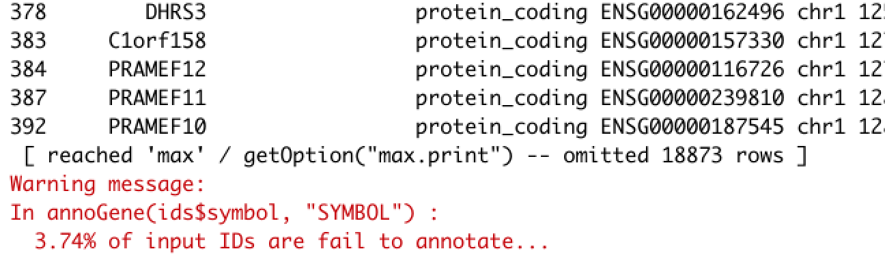

# 整合全部的bioconductor里面的芯片探针注释包

郑重申明：此包idmap1存放在GitHub，仅仅是一个草稿，不会再维护，也不会更新，是为了说明我最后的annoprobe包的开发历程。

一般有**三种方法**可以得到芯片探针与gene的对应关系： 

- 金标准当然是去基因芯片的厂商的官网直接去下载啦

- **一种是直接用bioconductor的包**。

- **一种是从NCBI里面下载文件来解析好！**

首先，我们说官网，肯定可以找到，不然这种芯片出来就没有意义了！然后，我们看看NCBI下载的soft文件，会比较大

- http://www.ncbi.nlm.nih.gov/geo/query/acc.cgi?acc=GPL6947

不过，这两种方法都比较麻烦，需要自行摸索很多才能获得比较高质量的芯片注释关系。

但是R的bioconductor包其实是有芯片探针与gene的对应关系的，也就是说一般重要的芯片在R的bioconductor里面都是有包的。

### 但是用户需要每个R包独立下载安装后获取芯片探针注释信息

比如下面的这些芯片：

```
gpl	bioc_package	title
GPL201	hgfocus	[HG-Focus] Affymetrix Human HG-Focus Target Array
GPL96	hgu133a	[HG-U133A] Affymetrix Human Genome U133A Array
GPL571	hgu133a2	[HG-U133A_2] Affymetrix Human Genome U133A 2.0 Array
GPL97	hgu133b	[HG-U133B] Affymetrix Human Genome U133B Array
GPL570	hgu133plus2	[HG-U133_Plus_2] Affymetrix Human Genome U133 Plus 2.0 Array
GPL13667	hgu219	[HG-U219] Affymetrix Human Genome U219 Array
GPL8300	hgu95av2	[HG_U95Av2] Affymetrix Human Genome U95 Version 2 Array
GPL91	hgu95av2	[HG_U95A] Affymetrix Human Genome U95A Array
GPL92	hgu95b	[HG_U95B] Affymetrix Human Genome U95B Array
GPL93	hgu95c	[HG_U95C] Affymetrix Human Genome U95C Array
GPL94	hgu95d	[HG_U95D] Affymetrix Human Genome U95D Array
GPL95	hgu95e	[HG_U95E] Affymetrix Human Genome U95E Array
GPL887	hgug4110b	Agilent-012097 Human 1A Microarray (V2) G4110B (Feature Number version)
GPL886	hgug4111a	Agilent-011871 Human 1B Microarray G4111A (Feature Number version)
GPL1708	hgug4112a	Agilent-012391 Whole Human Genome Oligo Microarray G4112A (Feature Number version)
GPL13497	HsAgilentDesign026652	Agilent-026652 Whole Human Genome Microarray 4x44K v2 (Probe Name version)
GPL6244	hugene10sttranscriptcluster	[HuGene-1_0-st] Affymetrix Human Gene 1.0 ST Array [transcript (gene) version]
GPL11532	hugene11sttranscriptcluster	[HuGene-1_1-st] Affymetrix Human Gene 1.1 ST Array [transcript (gene) version]
GPL6097	illuminaHumanv1	Illumina human-6 v1.0 expression beadchip
GPL6102	illuminaHumanv2	Illumina human-6 v2.0 expression beadchip
GPL6947	illuminaHumanv3	Illumina HumanHT-12 V3.0 expression beadchip
GPL10558	illuminaHumanv4	Illumina HumanHT-12 V4.0 expression beadchip
GPL6885	illuminaMousev2	Illumina MouseRef-8 v2.0 expression beadchip
GPL81	mgu74av2	[MG_U74Av2] Affymetrix Murine Genome U74A Version 2 Array
GPL82	mgu74bv2	[MG_U74Bv2] Affymetrix Murine Genome U74B Version 2 Array
GPL83	mgu74cv2	[MG_U74Cv2] Affymetrix Murine Genome U74 Version 2 Array
GPL339	moe430a	[MOE430A] Affymetrix Mouse Expression 430A Array
GPL6246	mogene10sttranscriptcluster	[MoGene-1_0-st] Affymetrix Mouse Gene 1.0 ST Array [transcript (gene) version]
GPL340	mouse4302	[MOE430B] Affymetrix Mouse Expression 430B Array
GPL1261	mouse430a2	[Mouse430_2] Affymetrix Mouse Genome 430 2.0 Array
GPL8321	mouse430a2	[Mouse430A_2] Affymetrix Mouse Genome 430A 2.0 Array
```

如果用户需要对**GPL570	hgu133plus2	[HG-U133_Plus_2] Affymetrix Human Genome U133 Plus 2.0 Array**进行注释，就需要：

```r
library(hgu133plus2.db)
ids=toTable(hgu133plus2SYMBOL)
head(ids)
```

得到的信息如下：

```
> head(ids)
   probe_id symbol
1   1053_at   RFC2
2    117_at  HSPA6
3    121_at   PAX8
4 1255_g_at GUCA1A
5   1316_at   THRA
6   1320_at PTPN21
> 
```

很多时候，用户是**找不到这些GPL平台对应的R包**，或者**下载安装困难**，其实仅仅是需要探针与基因对应关系，没有必要去下载安装这几十个M的包。

### 安装我的idmap1包

```r
library(devtools)
install_github("jmzeng1314/idmap1")
library(idmap1)
```

如果报错，请先安装 **GEOquery** 包。

```
if (!requireNamespace("BiocManager", quietly = TRUE))
    install.packages("BiocManager")

BiocManager::install("GEOquery")
```

有了idmap1这个包，基本上就可以告别bioconductor里面的全部芯片的探针ID注释包啦

获取同样的**GPL570	hgu133plus2	[HG-U133_Plus_2] Affymetrix Human Genome U133 Plus 2.0 Array**注释信息，一行代码就搞定！

```r
library(idmap1)
ids=getIDs('gpl570')
head(ids)
```

是不是很方便啦！

其实我就是在自己电脑里面把所有的bioconductor的芯片相关R包注释信息全部获取整理好了，这样的话，你无需下载安装那些R包，直接使用我的整理好的数据即可。

### 一个芯片数据挖掘实战

结合我们昨天的发布的 [GEO数据库中国区镜像横空出世](https://mp.weixin.qq.com/s/0rXp-n4NvCmwqh4eyGJvQw)，随时随地方便下载GEO数据集，并且进行ID转换！

```r
library(GEOmirror)
library(idmap1) 
geoChina('gse6222')
load('GSE6222_eSet.Rdata')
gset
a=exprs(gset[[1]])
a[1:4,1:4]
gset[[1]]@annotation
# 这里可以看到，这个数据集，使用的 GPL570 平台哦
b=getIDs("GPL570")
head(b)
```

### 还有一个小功能

就是对基因名字进行注释，需要注意的是基于gencode数据库的v31版本哦，因为此包不更新不维护，所以不建议继续使用它！

```
IDs <- c("DDX11L1", "MIR6859-1", "OR4G4P", "OR4F5")
ID_type = "SYMBOL"
annoGene(IDs, ID_type)
```

简单注释结果如下：

```
> IDs <- c("DDX11L1", "MIR6859-1", "OR4G4P", "OR4F5")
> ID_type = "SYMBOL"
> annoGene(IDs, ID_type)
   SYMBOL                           biotypes         ENSEMBL  chr start   end
1 DDX11L1 transcribed_unprocessed_pseudogene ENSG00000223972 chr1 11869 14409
5  OR4G4P             unprocessed_pseudogene ENSG00000268020 chr1 52473 53312
7   OR4F5                     protein_coding ENSG00000186092 chr1 65419 71585
Warning message:
In annoGene(IDs, ID_type) : 25% of input IDs are fail to annotate... 
> 
```

同样的，我们前面注释好的探针基因对应关系，也可以进行进一步注释：

```
ids=getIDs('gpl570')
head(ids)
annoGene(ids$symbol,'SYMBOL')
```

得到如下的注释结果：



是不是很实用啊，尤其是你下载了TCGA数据库的RNA-seq数据分析结果表达矩阵， 就可以通过基因ID把矩阵拆分成为编码蛋白的基因或者非编码基因哦。

#### 文末友情宣传

强烈建议你推荐给身边的**博士后以及年轻生物学PI**，多一点数据认知，让他们的科研上一个台阶：

- [全国巡讲全球听（买一得五）](https://mp.weixin.qq.com/s/sgmSCK4GuAY0-bPDua34cg) ，你的生物信息学入门课
- [生信技能树的2019年终总结](https://mp.weixin.qq.com/s/azTBe54kv3OpS16hrSKzQQ)  ，你的生物信息学成长宝藏
- [2020学习主旋律，B站74小时免费教学视频为你领路](https://mp.weixin.qq.com/s/Y-8YKye2jOw2tSLJnCvBlA)

